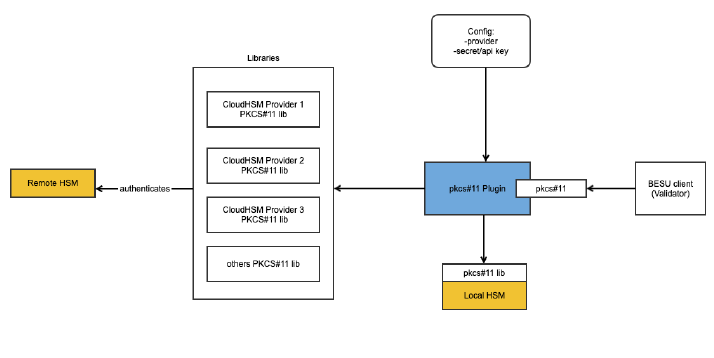

# Besu HSM Plugin
 [](https://github.com/besu-eth/besu-hsm-plugin/blob/main/LICENSE)
 [](https://github.com/besu-eth/besu/releases/tag/26.4.0)
 [](https://discord.com/invite/hyperledger)

A Hardware Security Module (HSM) plugin for [Hyperledger Besu](https://github.com/besu-eth/besu). This plugin enables Besu 
validators to delegate cryptographic signing operations to an HSM, keeping private 
keys secure in dedicated hardware rather than in software.

Two provider modes are supported:

- **Generic PKCS#11** — Uses Java's SunPKCS11 provider to work with any [PKCS#11](https://en.wikipedia.org/wiki/PKCS_11) compatible HSM
  (SoftHSM2, YubiHSM2, Thales Luna, etc.)
- **AWS CloudHSM JCE** — Uses the [AWS CloudHSM JCE provider](https://docs.aws.amazon.com/cloudhsm/latest/userguide/java-library-install.html)
  for direct integration with AWS CloudHSM

## Architecture



The plugin sits between the Besu client (validator) and HSM providers. It supports:

- **Generic PKCS#11** — Connect to any PKCS#11-compatible HSM via Java's SunPKCS11 provider
  (cloud or local: AWS CloudHSM, Azure Dedicated HSM, Google Cloud HSM, SoftHSM2, YubiHSM2, etc.)
- **AWS CloudHSM JCE** — Connect directly to AWS CloudHSM via the CloudHSM JCE provider (no
  PKCS#11 configuration needed)
- **Configuration** — Provider selection, key aliases, and authentication are specified through
  plugin CLI options

## HSM Key Setup

The plugin needs access to a private key and its corresponding public key on the PKCS#11 token. Java's SunPKCS11
`KeyStore` API requires a certificate to be associated with a private key — without one, the `KeyStore` will not
surface the private key entry at all. The certificate serves no cryptographic purpose; a self-signed certificate
is sufficient.

There are two approaches depending on where the key pair is generated:

### Option A: Generate Key Externally with OpenSSL

Generate the key pair and certificate with OpenSSL, then import everything into the HSM.

```shell
# Generate EC key pair and self-signed certificate
openssl ecparam -name secp256k1 -genkey -noout -out ec-key.pem
openssl req -new -x509 -key ec-key.pem -out ec-cert.pem -days 365 -subj "/CN=besu-hsm" -sha256

# Convert to DER format
openssl ec -in ec-key.pem -outform DER -out ec-key.der
openssl ec -in ec-key.pem -pubout -outform DER -out ec-pub.der
openssl x509 -in ec-cert.pem -outform DER -out ec-cert.der

# Import private key, public key, and certificate into HSM
pkcs11-tool --module <pkcs11-lib> --login --pin <pin> \
    --write-object ec-key.der --type privkey --label mykey --id 01 --usage-derive
pkcs11-tool --module <pkcs11-lib> --login --pin <pin> \
    --write-object ec-pub.der --type pubkey --label mykey --id 01 --usage-derive
pkcs11-tool --module <pkcs11-lib> --login --pin <pin> \
    --write-object ec-cert.der --type cert --label mykey --id 01
```

### Option B: Generate Key on the HSM with `pkcs11-tool`

Generate the key pair directly on the HSM, then create a self-signed certificate using OpenSSL's PKCS#11 engine 
(requires `libengine-pkcs11-openssl` / `libp11`). This keeps the private key on the HSM at all times.

```shell
# 1. Generate key pair on the HSM
pkcs11-tool --module <pkcs11-lib> --login --pin <pin> \
    --keypairgen --key-type EC:secp256k1 \
    --label mykey --id 01 --usage-sign --usage-derive

# 2. Create OpenSSL engine config (adjust paths for your platform)
cat > openssl-p11.cfg <<EOF
openssl_conf = openssl_def
[openssl_def]
engines = engine_section
[engine_section]
pkcs11 = pkcs11_section
[pkcs11_section]
engine_id = pkcs11
dynamic_path = /usr/lib/x86_64-linux-gnu/engines-3/pkcs11.so
MODULE_PATH = <pkcs11-lib>
EOF

# 3. Generate self-signed certificate (signed by the HSM private key)
#    The key is referenced via a PKCS#11 URI (RFC 7512) using stable
#    token/object labels rather than volatile slot numbers.
OPENSSL_CONF=openssl-p11.cfg openssl req -x509 -new \
    -engine pkcs11 -keyform engine \
    -key "pkcs11:token=<token-label>;object=mykey;type=private" \
    -passin "pass:<pin>" \
    -sha256 -subj "/CN=besu-hsm" -days 365 \
    -out cert.pem

# 4. Import certificate back to the HSM
openssl x509 -in cert.pem -outform DER -out cert.der
pkcs11-tool --module <pkcs11-lib> --login --pin <pin> \
    --write-object cert.der --type cert --label mykey --id 01
```

### Note on the Certificate Requirement

This is a limitation of Java's SunPKCS11 `KeyStore` implementation, not PKCS#11 itself. The PKCS#11 standard
does not require certificates for key access, but Java's `KeyStore` abstraction models private keys as
`PrivateKeyEntry` objects which always include a certificate chain. Without a certificate, `KeyStore.getKey()`
will not return the private key at all.

## Plugin CLI Options

The plugin registers the following CLI options with Besu:

| Option | Description | Required |
|--------|-------------|----------|
| `--plugin-hsm-provider-type` | Provider type: `generic-pkcs11` (default) or `cloudhsm-jce` | No |
| `--plugin-hsm-config-path` | Path to the PKCS#11 configuration file | `generic-pkcs11` only |
| `--plugin-hsm-password-path` | Path to the file containing the token PIN/password | `generic-pkcs11` only |
| `--plugin-hsm-key-alias` | Alias/label of the private key on the HSM | Yes |
| `--plugin-hsm-public-key-alias` | Alias/label of the public key on the HSM | `cloudhsm-jce` only |
| `--plugin-hsm-cloudhsm-jar-path` | Path to CloudHSM JCE jar file or directory (default: `/opt/cloudhsm/java`) | No |
| `--plugin-hsm-ec-curve` | EC curve: `secp256k1` (default) or `secp256r1` | No |

### Generic PKCS#11 Example

```shell
besu --security-module=hsm \
  --plugin-hsm-config-path=/etc/besu/pkcs11.cfg \
  --plugin-hsm-password-path=/etc/besu/hsm-pin.txt \
  --plugin-hsm-key-alias=mykey
```

> **Certificate requirement:** Java's SunPKCS11 `KeyStore` retrieves the public key via the
> certificate associated with the key alias (`KeyStore.getCertificate()`). The HSM must have a
> certificate stored alongside the private key — a self-signed certificate is sufficient.

> **ECDH key agreement:** Besu uses ECDH for devp2p handshakes. For this to work through
> SunPKCS11, the PKCS#11 configuration file must allow Java to extract the derived shared secret.
> Add the following to your configuration file:
>
> ```
> attributes(generate,CKO_SECRET_KEY,CKK_GENERIC_SECRET) = {
>   CKA_SENSITIVE = false
>   CKA_EXTRACTABLE = true
> }
> ```
>
> See [`docker/softhsm2/config/pkcs11-softhsm.cfg`](docker/softhsm2/config/pkcs11-softhsm.cfg)
> for a complete example. Some HSMs (e.g., AWS CloudHSM) do not allow these attributes — use the
> `cloudhsm-jce` provider type instead.

### AWS CloudHSM JCE Example

The `cloudhsm-jce` provider uses the [AWS CloudHSM JCE provider](https://docs.aws.amazon.com/cloudhsm/latest/userguide/java-library-install.html)
directly rather than going through a PKCS#11 library. The CloudHSM JCE jar is auto-discovered from
`/opt/cloudhsm/java/` by default. Use `--plugin-hsm-cloudhsm-jar-path` to override with a custom
directory or a direct path to the jar file.

Authentication is handled via the `HSM_USER` and `HSM_PASSWORD` environment variables (or
equivalent system properties) as documented by AWS.

```shell
export HSM_USER=besu_crypto_user
export HSM_PASSWORD=<password>

besu --security-module=hsm \
  --plugin-hsm-provider-type=cloudhsm-jce \
  --plugin-hsm-key-alias=my-private-key \
  --plugin-hsm-public-key-alias=my-public-key
```

> **Note:** The CloudHSM JCE provider requires separate aliases for the private and public keys
> because CloudHSM does not associate certificates with key entries the way Java's SunPKCS11
> `KeyStore` does.

For a complete walkthrough of setting up a QBFT network with AWS CloudHSM, see the
[AWS CloudHSM guides](docs/aws-CloudHSM/).

## Experimental: secp256r1 Curve Support

The plugin supports the secp256r1 (NIST P-256) elliptic curve as an alternative to the default
secp256k1. This is controlled by the `--plugin-hsm-ec-curve` CLI option:

```shell
--plugin-hsm-ec-curve=secp256r1
```

Besu itself must also be configured to use secp256r1 via the `ecCurve` field in the genesis file.
See the [Besu documentation on alternative elliptic curves](https://besu.hyperledger.org/private-networks/how-to/configure/curves)
for details.

> **Note:** Alternative elliptic curve support in Besu is experimental. The secp256r1 curve has been
> tested with SoftHSM2 in a 4-node QBFT network. When generating HSM keys for secp256r1, pass
> `EC_CURVE=secp256r1` to the Docker setup scripts (e.g. `entrypoint-setup.sh`).

## Known Limitations

### DiscV5 (Discovery v5) Not Supported

The PKCS#11 HSM plugin does not support the `calculateECDHKeyAgreementCompressed` method required
by Besu's DiscV5 discovery protocol. This method needs the full compressed EC point (SEC1 format:
prefix byte + x-coordinate) from the ECDH scalar multiplication, but the PKCS#11 standard's
`CKM_ECDH1_DERIVE` mechanism only returns the x-coordinate — the y-parity needed for the
compression prefix is discarded.

**Impact:** HSM-backed validators must use DiscV4 (`--bootnodes`) or static peering
(`--static-nodes-file`) for peer discovery rather than relying on DiscV5.

> **Note:** Support for compressed ECDH key agreement is planned and will be available once the
> next Besu release includes the required `SecurityModule` API changes.

## Useful Links

* [Besu User Documentation](https://besu.hyperledger.org)
* [Besu HSM Plugin Issues]
* [Besu Wiki](https://lf-hyperledger.atlassian.net/wiki/spaces/BESU/)
* [How to Contribute to Besu](https://lf-hyperledger.atlassian.net/wiki/spaces/BESU/pages/22156850/How+to+Contribute)
* [Besu Maintainers](https://github.com/besu-eth/besu/blob/main/MAINTAINERS.md)

## Issues

Besu HSM Plugin issues are tracked [in the github issues tab][Besu HSM Plugin Issues].

If you have any questions, queries or comments, [Besu channel on Discord] is the place to find us.

## Besu HSM Plugin Developers

* [Contributing Guidelines]
* [Coding Conventions](https://lf-hyperledger.atlassian.net/wiki/spaces/BESU/pages/22154259/Coding+Conventions)

### Development

Instructions for how to get started with developing on the Besu HSM Plugin codebase. Please also read the
[wiki](https://lf-hyperledger.atlassian.net/wiki/spaces/BESU/pages/22154251/Pull+Requests) for more details on how to submit a pull request (PR).

### Prerequisites

* [Java 21+](https://adoptium.net/)
* [Gradle](https://gradle.org/) (or use the included Gradle wrapper)

### Building

```bash
./gradlew build
```

### Running Tests

```bash
# Unit tests
./gradlew test

# Integration tests (requires Docker)
./gradlew integrationTest
```

> **Note:** Integration tests build the SoftHSM2 image from `docker/softhsm2/Dockerfile`,
> pinning `hyperledger/besu` to the version declared in `gradle/libs.versions.toml`
> (`besu = "..."`). Bumping the catalog automatically updates the integration-test image.

[Besu HSM Plugin Issues]: https://github.com/besu-eth/besu-hsm-plugin/issues
[Besu channel on Discord]: https://discord.com/invite/hyperledger
[Contributing Guidelines]: CONTRIBUTING.md
